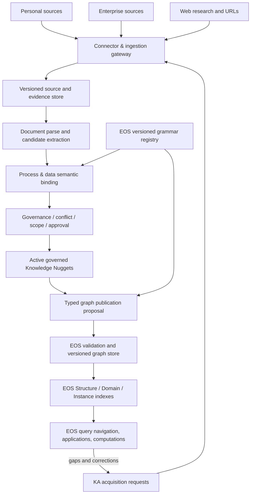

# KA Enhancement — Technical Requirements

**Document ID:** KA-ENH-001  
**Version:** 1.0  
**Date:** 2026-10-08  
**Status:** Proposed implementation plan; no code changes authorized by this document  
**Repositories:** [`pankajkamble75/ka`](https://github.com/pankajkamble75/ka) and [`pankajkamble75/enterprise-os-070626`](https://github.com/pankajkamble75/enterprise-os-070626)  
**Primary audience:** Coding agent, architect, QA agent

## 1. Executive objective

Enhance the existing Knowledge Acquisition (KA) service so it can securely acquire **personal documents, workplace documents, and internet content**, extract **evidence-backed, governed Knowledge Nuggets**, and supply process-oriented knowledge to Enterprise OS (EOS) through **versioned, validated contracts**.

Knowledge must describe **what a process is**, **what it does**, and, where evidenced, **how it operates**: decomposition, process type, actors, entities, inputs, outputs, rules, events, state transitions, data mappings, and cross-process relationships. KA must be able to accumulate partial knowledge without inventing missing facts.

**Principal invariant:** KA acquires and governs knowledge. **EOS owns Process Grammar, Process Types, Data Grammar, graph structure, domain/instance publication, navigation, computation, and execution.** KA shall not bypass EOS governance or directly answer runtime business questions.

## 2. Existing implementation — reuse before replacing

The current `ka` repository already contains the following seams; agents shall inspect their up-to-date implementations before editing:

| Existing file | Existing responsibility | Enhancement direction |
|---|---|---|
| `ka/ingestion.py` | Upload, paste, note, link, connector payload; source versions | Managed connectors, incremental sync and provenance |
| `ka/extraction.py` | Document-to-text and candidate statement extraction | Layout-aware, process-aware, multimodal extraction |
| `ka/model.py`, `ka/vocab.py` | Sources, evidence, nuggets, scope, controlled vocabulary | Typed process assertions and grammar-binding metadata |
| `ka/governance.py`, `ka/conflict.py` | Review, conflicting claims, approval | Process-level conflicts and approval policy |
| `ka/versioning.py`, `ka/repository.py` | Governed versions and persistence | Scalable persistence and lifecycle consistency |
| `ka/lineage.py` | Source/nugget-to-graph lineage | Evidence at claim/field level and reverse dependencies |
| `ka/graph_change.py`, `ka/graph_adapter.py` | Graph change proposals and EOS adapter | EOS v2 grammar-aware compile/validate/publish bridge |
| `ka/scope.py`, `ka/promotion.py` | Structure/domain/instance scope and promotion | Preserve lowest-valid-scope and override rules |
| `ka/research.py` | Research agents and URL-based internet research | Discovery, retrieval and source verification |
| `ka/runtime_guard.py` | Prevents KA from answering runtime questions | Retain and extend invariant tests |
| `ka/api.py`, `ka/console/` | API and governance console | Authenticated operational pages and EOS integration |
| `ka/events.py`, `ka/audit.py` | Events and audit | Reliable delivery, tracing and observability |

EOS reference architecture: `docs/architecture/process-typed-graph.md`, `docs/architecture/grammar-first-navigation.md`, `knowledge_worker/graph_model/grammar.json`, `knowledge_worker/graph_model/process_types.json`, and the versioned graph store. **Verify actual files, classes and schemas on the target branch before implementation.** EOS v2 uses recursive Process nodes, grammar-backed navigation, Structure → Domain → Instance, and versioned substructures with pinned instances.

### Verified design limitations from code review

1. `IngestionService.connect()` accepts a **prefetched payload**; full provider connection/synchronization is not implemented by that method.
2. `InternetResearchAgent` mainly fetches **explicit URLs** and is guarded by `KA_RESEARCH_INTERNET`; it is not general web discovery.
3. `KnowledgeType.PROCESS_STEP` alone does not express the complete EOS typed process graph.
4. `GraphChangeService._changes_from` compiles nuggets to comparatively **generic node/edge changes** with titles and statements; it is not a demonstrated full EOS v2 grammar compiler.
5. KA architecture documentation explicitly says **authentication/authorization enforcement at the API edge was deferred**.
6. PDF extraction may produce unavailable text for scanned documents.

These are **code-level observations**, not production test results. Baseline runtime behavior and deployment configuration remain to be verified.

## 3. Scope and non-goals

### In scope
- Local/manual documents, personal connected content, enterprise connected content, and public internet content.
- Parsing and preservation of source structure, provenance, content versions, and source permissions.
- Evidence-backed knowledge candidates, process extraction, normalization, governance and graph publication proposals.
- EOS grammar compatibility, APIs/events, gap/correction loops, security and operational UI.
- Automated testing and production-readiness instrumentation.

### Out of scope
- Rebuilding the EOS question-answering or navigation engine within KA.
- Making KA a second enterprise process-graph store or allowing KA to define grammar autonomously.
- Replacing existing ERP/CRM/data platforms or migrating all EOS graphs as part of this change.
- Automatically promoting instance facts to universal Structure or editing Process Type definitions without explicit human approval.
- Circumventing permissions for personal or work content, or unauthorized internet crawling.

## 4. Target logical architecture



**Boundary:** Documents are sources; extracted statements are candidates; approved nuggets are governed knowledge; typed graph elements are EOS compilations. These are different artifacts with distinct identity and lifecycle.

## 5. Functional requirements

### KA-REQ-001 — Unified source registration (P0)
- Support upload, paste, note, URL, and connector-sourced ingestion through a common registration service.
- Capture source `tenant_id`, `principal_id`, source class (`personal`, `team`, `enterprise`, `public`), provider, locator, MIME, author, creation/retrieval/effective dates, SHA-256 checksum, owner, access policy, collection metadata and ingestion method.
- Store immutable content versions and reference their original binary and parsed representations. Content-hash duplicates shall not create duplicate versions within the same source identity.
- Do not infer ownership or grant permissions from document title or content.
- Preserve existing API clients where possible; implement schema migration and compatibility tests.

**Acceptance:** Re-ingesting unchanged material is idempotent; changed content creates a new version; source bytes and extraction are recoverable with valid permission.

### KA-REQ-002 — Managed connectors and synchronization (P0)
- Build a provider-agnostic `Connector` contract with capabilities `authorize`, `enumerate`, `fetch`, `get_permissions`, `checkpoint`, `sync_incremental`, `revoke` (capability-dependent).
- Initial candidates: user-upload/local folder, one personal cloud-drive provider and one enterprise document provider selected after credential/permission assessment. Email and code repositories follow the same contract.
- Support pagination, rate limits, retries with backoff, token expiry, provider error classification, incremental cursor, scheduled and manual sync, permission update, soft-delete, and connection revocation.
- Fetch through provider-approved authentication; do not persist raw refresh tokens or secrets in source/nugget payloads. Use secret-management infrastructure.
- Design connector abstractions independently of any ChatGPT connector; deployment credentials and consent remain under application control.

**Acceptance:** New, modified, moved, deleted, and permission-restricted documents are reconciled without losing history; a revoked connector stops retrieval.

### KA-REQ-003 — Internet discovery and acquisition (P1)
- Add research discovery: query → search result metadata → candidate source selection → fetch → extract → evidence → governed candidates.
- Preserve canonical URL, publisher, fetched/published timestamps, citation locator, source attribution and usage restrictions.
- Honor robots/publisher rules where applicable, site terms, safety limits, allowed domains and crawl budgets; do not bypass paywalls or authentication.
- Never treat model-generated text as a verified internet source; record unknown publication dates and uncertain assertions.

**Acceptance:** A general domain-process research question can produce traceable external candidates with original URLs, not just synthetic LLM statements; unsupported or inaccessible content is marked as such.

### KA-REQ-004 — Layout-aware document extraction (P1)
- Preserve sections, headings, paragraph order, table cells, page numbers, spreadsheet sheet/row/column, slide and figure references, and diagram associations where feasible.
- Add configurable OCR for scanned PDFs/images, multimodal interpretation for flowcharts and tables, and explicit extraction confidence/quality flags.
- Chunk at semantic section boundaries and maintain stable source-span identifiers. Avoid treating table headers as free-standing facts.
- Maintain original content and extraction version to support re-processing after extractor upgrades.

**Acceptance:** Evidence can link back to an exact page, section or row; a scanned SOP yields reviewable candidate process facts, or a clear unsupported/failed status.

### KA-REQ-005 — Process-aware knowledge model (P0)
- Introduce a **typed process assertion** schema associated with one or more Knowledge Nugget versions, rather than replacing existing nugget types.
- Required for a candidate identifying a process: `process_name`, `process_description`, evidence reference(s), extraction confidence, proposed scope and source version.
- Optional, **only when evidenced**: parent process, process type, process decomposition and sequence, preconditions, inputs, outputs, actor/system, rules/controls, events, prior/resulting states, transformations, entities, canonical data roles/attributes, temporal qualifiers and inter-process relationships.
- Explicitly represent `unknown`, `ambiguous`, `not_applicable` and `not_evidenced` without fabricating values.
- Preserve one nugget or assertion per independently governable claim; a process profile is a **composed view** of multiple evidence-backed claims, not a giant indivisible nugget.
- Use canonical stable identity and aliases for matching; separate human-readable name from process identity.

**Suggested extensible schema (illustrative, not locked API):**

```json
{
  "assertion_id": "pa_123",
  "subject": {"kind": "process", "canonical_key": "merchant_underwriting"},
  "predicate": "description",
  "value": "Evaluates merchant applications for processing eligibility",
  "evidence_refs": ["ev_456"],
  "source_version_refs": ["sv_789"],
  "scope": {"type": "DOMAIN", "id": "merchant_acquiring"},
  "confidence": 0.94,
  "effective_from": null,
  "grammar_binding": {
    "grammar_version": "<EOS-provided-version>",
    "process_type": "decision",
    "binding_status": "proposed"
  },
  "governance_status": "CANDIDATE"
}
```

**Acceptance:** From an underwriting SOP, KA identifies process description and evidential activities separately; missing state transitions remain unknown; every populated property traces to supporting spans.

### KA-REQ-006 — EOS grammar binding and semantic alignment (P0)
- EOS is the **source of truth** for Process Grammar, Process Types, Data Grammar, node/edge vocabularies, canonical transformations and lifecycle states.
- Expose a **read-only, versioned grammar descriptor contract** from EOS for KA's validation/binding; cache by digest/version and fail closed on incompatible revisions.
- Bind candidate processes to known process types and process grammar slots; bind input/output entities, data roles, attributes, and declared relationships to EOS Data Grammar.
- Distinguish source-evidenced assertions from inferred mappings. Persist binding method, confidence, alternatives and grammar version.
- Do not force all candidates into known vocabulary; unresolved bindings go to review/knowledge-gap queues. Adding a new process type or Structure primitive requires EOS governance.
- Respect EOS process recursion: an activity is a nested Process, not a competing top-level kind.

**Acceptance:** Correctly binds an existing known process; an unsupported process type is flagged without silent coercion; bindings can be recomputed on a new grammar release without mutating historical nugget versions.

### KA-REQ-007 — Evidence, conflicts, provenance and scope (P0)
- Each atomic assertion has a source-version reference and exact evidence locator(s). Preserve field-level evidence in composed process views.
- Identify duplicate, supporting, refining, contradictory, specializing and superseding claims; do not collapse conflicting process sequences silently.
- Preserve scope and inheritance: Structure / parent domain (if configured) / Domain / Instance. Default to the lowest valid scope and require review before broad promotion.
- Model time validity and source authority independently of confidence. Personal or restricted evidence must not promote to a broader visibility without explicit authorization.
- Allow corrections, provenance explanation, review decisions, evidence reassignment and rollback audit.

**Acceptance:** Two conflicting SOP versions show the contradiction and effective dates; an instance-specific override does not overwrite the domain process definition.

### KA-REQ-008 — Secure identity and authorization (P0 — launch blocker)
- Implement authentication at all API/UI boundaries, including downloads, source and evidence reads, search, research, governance and publication operations.
- Enforce tenant isolation, user/team/enterprise ACLs, source-level authorization, inherited/restricted nugget visibility, least privilege and service-to-service authorization.
- Resolve the permission model for multi-source nuggets using the **intersection / most restrictive effective audience**; never broaden read access through compilation, search, citations or derived summaries.
- Prevent unauthorized private-source access by research agents and derived graph artifacts. Support audit trails, retention rules and source revocation; evaluate the needed policy for previously published derived knowledge.
- Scrub secrets and personal data from logs; apply prompt-injection defenses to retrieved content; enforce URL SSRF protection, file validation, size limits and malware scanning appropriate to deployment.

**Acceptance:** Cross-user and cross-tenant access tests deny all read/write and inference paths; deleting access to a source removes unauthorized future visibility, including derived answers and citations.

### KA-REQ-009 — EOS v2 graph publication contract (P0)
- Replace the simplistic direct nugget-to-generic-node compiler with a **typed, dry-run-first publication bridge** compatible with the currently deployed EOS graph schema.
- Publication flow: active nuggets → process profile / knowledge assertions → grammar binding → graph diff proposal → EOS validation → required approval → versioned EOS commit → index refresh → lineage reconciliation.
- EOS validates node kinds, process nesting, allowable typed relations, required properties, graph invariants, version pins, provenance, permissions, and schema/grammar version.
- Use stable canonical identities: two claims about the same process should usually update/enrich one process, not create duplicate nodes from title slugs.
- Support idempotency keys, optimistic concurrency, source/nugget/graph version references, conflict-on-stale, durable outbox/event reconciliation and publication state machine.
- Domain changes create **new immutable substructure versions**; instances stay pinned until explicit repin. Structure and Process Type edits remain manual/proposal-only.
- Provide preview, affected element/instance list, approval rationale, rollback strategy and reverse source/graph lineage.

**Acceptance:** Approval publishes a valid process graph version without mutating pinned instances; duplicate retries cause no duplicate elements; rejected/stale proposals never alter EOS.

### KA-REQ-010 — EOS knowledge request and feedback loop (P0)
- Extend existing gap and correction seams (`POST /api/knowledge-acquisition/runtime/graph-gap`, correction and lineage endpoints) with an authenticated, versioned request contract.
- EOS sends request ID, requesting principal, instance/domain context, grammar-intent decomposition, required knowledge type, missing semantics, permitted visibility and correlation/trace IDs.
- KA returns mission status, candidate/approved nugget references and publication status through polling or events; EOS does not consume unapproved claims as runtime graph truth.
- Deduplicate equivalent requests, support cancellation, capture completion/failure and maintain lineage from original EOS question through source → nugget → publication.

**Acceptance:** Asking EOS a process question with missing rules creates a traceable acquisition request; after approval and publication EOS answers via its graph, not KA retrieval.

### KA-REQ-011 — API and event interface (P0)

These are **proposed logical contracts**, not claims of existing routes. Prefer adapting existing `/api/knowledge-acquisition/*` routes with versioned adapters and backward compatibility.

| Operation | Proposed API | Expected behavior |
|---|---|---|
| Search governed knowledge | `POST /v1/knowledge/query` | Filter by principal, scope, kind, status, validity |
| Process profile | `GET /v1/processes/{process_id}/knowledge` | Evidence-backed assertions and binding status |
| Submit source / sync | `POST /v1/sources`, `POST /v1/connectors/{id}/sync` | Idempotent ingestion/sync jobs |
| Acquisition gap | `POST /v1/acquisition-requests` | Correlated, authorized request |
| Research mission | `POST /v1/research-missions` | Bounded provenance-aware mission |
| Evidence lookup | `GET /v1/knowledge/{id}/evidence` | Auth-checked citations and source locations |
| Prepare publication | `POST /v1/graph-publications/prepare` | Typed diff and EOS validation results |
| Commit publication | `POST /v1/graph-publications/{id}/commit` | Approved idempotent change |
| Correction | `POST /v1/corrections` | Governed correction lifecycle |

Define JSON Schema/OpenAPI for every operation, stable error codes, pagination, idempotency/ETag handling, correlation IDs, authentication scopes, capability negotiation, timeout and retry policies. Do not place source text or secrets in publication/event envelopes; use authorized references.

**Suggested event families:** `source.synced`, `source.permission_changed`, `source.revoked`, `extraction.completed`, `knowledge.candidate_created`, `knowledge.approved`, `knowledge.conflicted`, `graph.publication_prepared`, `graph.publication_committed`, `graph.publication_failed`, `acquisition.requested`, `acquisition.completed`. Events should be durable, versioned and at-least-once safe.

### KA-REQ-012 — KA operations console (P1)
Create **five simple, task-based pages**, reusing the current KA console wherever practical:

1. **Sources** — upload/connect, sync health, errors, permissions, source versions, document preview.
2. **Knowledge** — search/filter nuggets, evidence, status, scope, authority, conflicts, versions.
3. **Processes** — process name/description, parent/child steps, process types, actors/rules/states, coverage and unknowns, every field clickable to evidence.
4. **Review** — exception queues, conflicts, ambiguous bindings, approval and scope decisions.
5. **Publications** — EOS graph diff preview, validation results, affected instances, approvals, publication state and rollback history.

**UI principles:** No large all-in-one dashboard. Separate source submission/configuration from monitoring and review. Display a small operational summary and clear next action; allow drill-down. Never expose unauthorized sources or evidence through preview.

### KA-REQ-013 — EOS user interface (P1)
- Add a lightweight **Knowledge/Evidence** view to process detail (do not mirror KA admin console).
- For an EOS process show process name/description, process type, nested activities, linked data/rules/states, supporting nugget references, source citations and unresolved knowledge gaps.
- Provide actions `View evidence`, `Request research`, `Correct this`, `Add supporting document`; these invoke the KA service with EOS context and return to the current process.
- Distinguish source-based knowledge, inferred grammar mappings, approved graph semantics and missing information.

**Acceptance:** A user can trace a process statement to its source and request a correction without leaving the relevant EOS context permanently.

### KA-REQ-014 — Observability, operations and scale (P1)
- Record connector throughput, sync lag, extraction success, unsupported content, nugget production rates, conflict/review backlog, publication failures, knowledge coverage and graph-gap closure rates.
- Record model name, tokens, cost, latency, extraction version, prompt version, and reproducibility metadata where allowed.
- Use bounded jobs/queues, backpressure, retry/dead-letter handling and checkpoints. Validate whether the current JSON-per-object repository is acceptable at production volume; migrate only with benchmarks and an explicit data migration plan.
- Add health/readiness probes, integration telemetry and admin replay of failed ingestion/publication jobs.

## 6. Data and semantic design rules

### 6.1 Identity hierarchy
`Source → SourceVersion → EvidenceSpan → AtomicAssertion → GovernedNuggetVersion → GrammarBinding → EOS GraphElementVersion`.

Keep identifiers stable and independently addressable. Support multiple evidence spans for one claim and many claims for one process profile.

### 6.2 Process profile example (illustrative)

```yaml
process_id: process:merchant_underwriting
name: Underwrite Merchant Application
description: Evaluate a merchant application and determine eligibility
scope: {type: DOMAIN, id: merchant_acquiring}
process_type: decision  # validate against EOS registry
activities:
  - {name: Collect Application, type: interaction}
  - {name: Validate Application, type: control}
  - {name: Analyze Merchant Risk, type: analysis}
  - {name: Make Credit Decision, type: decision}
  - {name: Communicate Decision, type: interaction}
inputs: [merchant_application]
outputs: [underwriting_decision]
actors: [underwriting_team]
states: {before: pending_review, after: [approved, declined]}
evidence_refs: [ev_001, ev_002]
status: PROPOSED_BINDING
```

**Do not assume any of these illustrative details are true of an actual merchant.** Each should be supported by retrieved, scoped evidence. A profile does not justify filling undocumented fields.

### 6.3 Publication safety invariants
1. No raw or merely candidate knowledge is compiled as approved enterprise graph truth.
2. No semantic graph mutation without nugget/evidence/approval lineage.
3. No broader access in outputs than authorized source access.
4. No automatic Structure or Process Type vocabulary mutation.
5. No silent repinning of EOS instances on a new domain version.
6. No duplicate graph identities because titles differ.
7. No runtime answer served directly from KA search bypassing EOS.
8. No inference of missing process facts without an explicit uncertainty label and review path.
9. Every publication can be traced back and its effect verified or reverted under EOS version rules.

## 7. Implementation phases and dependencies

| Phase | Priority | Work packages | Exit gate |
|---|---|---|---|
| 0 — Baseline | P0 | Inspect latest branches; map current routes/types, grammar store, graph writes, tests and auth/deployment | Architecture/compatibility matrix; tests captured |
| 1 — Contracts & security | P0 | Process assertion schema, grammar descriptor, service auth, ACL policy, tenant isolation, API/version design | Schema validation + negative security tests |
| 2 — Process extraction | P0 | Process profiles, claim-level evidence, grammar binding, partial/unknown semantics | SOP extraction golden tests |
| 3 — Graph publishing | P0 | Dry-run diffs, EOS validation, version pins, approvals, idempotency, lineage | Safe end-to-end publication without duplicate/stale writes |
| 4 — Source expansion | P1 | Connector framework, incremental sync, web search/discovery, OCR/diagrams | Personal/enterprise/web source lifecycle tests |
| 5 — Experience/operations | P1 | Five KA pages, EOS evidence/context panel, telemetry, recovery | User journey + operations acceptance |

**Recommended execution policy:** Phase 0 first. Phase 1 security and contract design precede any remote connectors or externally exposed endpoints. Phase 2 and 3 may use synthetic documents while connectors are built. Do not execute concurrent edits across tightly coupled KA and EOS schemas without a shared reviewed contract and compatible branches.

## 8. Coding-agent work allocation

The coding agent should first create a **read-only discovery report** containing:
- Exact branch/commit SHA for each repo; class/function/route inventory.
- Current EOS grammar version, process-type vocabulary, graph invariants and store APIs.
- KA→EOS adapter compatibility matrix: source field, destination field, type, validation, security, risks.
- Baseline tests (pass/fail), reproducible local setup and gaps.
- Proposed API/OpenAPI and schema diffs, with explicit backward compatibility.
- Sequenced implementation tickets with file lists, dependencies and rollback plans.

**Then implement only after the user approves that work:**
- Assign independent modules to separate agents where practical (connector framework, extraction, UI, test harness).
- Serialize contract/schema changes and graph-store modifications behind reviewed interfaces.
- Every PR must include tests, migration notes, operational notes, security impact, API diff and proof of no unintended EOS graph change.
- Never use production documents containing restricted personal/work information as public test fixtures. Use synthetic or properly sanitized fixtures.

## 9. End-to-end acceptance scenarios

| ID | Scenario | Expected outcome |
|---|---|---|
| A1 | Upload private SOP | Private source/nuggets; no enterprise-wide visibility |
| A2 | Synchronize changed enterprise SOP | New source version; conflicts/time precedence reviewed; lineage preserved |
| A3 | Ingest scanned flowchart | Process candidate with page/figure evidence or explicit unsupported status |
| A4 | Research industry process from web search | Credible attributable URLs; candidates require governance |
| A5 | Extract underwriting process and activities | Process name, description, nested typed activities; evidence per populated claim |
| A6 | Unknown process type or grammar element | Explicit unresolved binding, not fabricated canonical mapping |
| A7 | Publish domain process update | EOS validates, creates new domain version, preserves existing instance pins |
| A8 | Retry publication request | Idempotent result, no duplicate graph element |
| A9 | Concurrent publication from outdated grammar/store | Conflict response; no partial graph mutation |
| A10 | Ask EOS about a missing process rule | EOS gap request → KA acquisition/review → publication → EOS graph answer |
| A11 | Cross-tenant/private evidence lookup | Access denied; neither content nor private metadata leaked |
| A12 | Revoke connector/document permission | Subsequent retrieval and derived response respect revocation policy |
| A13 | Conflict between two process descriptions | Both claims/evidence visible to authorized reviewer; no silent overwrite |
| A14 | Correction and rollback | Versioned correction, graph impact and reversible publication with audit |

### Quality gates
- Unit tests for models, grammar binding, ACL logic and idempotency.
- Contract tests between the KA API and EOS grammar/graph validation services.
- Integration tests with mocked provider connectors, real version transitions and synthetic documents.
- Security negative tests and prompt-injection/SSRF tests.
- Golden process extraction corpus covering at least five domains with both straightforward and ambiguous process descriptions.
- E2E live-console regression tests for EOS Structure → Domain → Instance navigation after publication.
- Cost/latency/error measurement, with explicit thresholds agreed during Phase 0 rather than guessed.

## 10. Risks and decisions requiring explicit approval

1. **Security model:** tenant boundary, enterprise directory/IAM integration, service identity and permitted derived knowledge retention after source revocation.
2. **Initial connectors:** choose based on real business usage and permissions (e.g., Microsoft 365/SharePoint vs Google Workspace); no provider is assumed enabled.
3. **KA persistence:** retain JSON-object store for prototype or migrate for concurrency/reliability; decide after load tests.
4. **Grammar negotiation:** EOS exposes descriptor API vs signed versioned schema artifacts; choose one authoritative mechanism.
5. **Graph publication host:** ensure mutation is executed by EOS under EOS validation, not unreviewed KA direct store writes.
6. **Approval policy:** what low-risk changes may be auto-approved, and who can approve broader-scope changes.
7. **Online vs batch:** connector refresh frequencies, research budgets, OCR/model budget ceilings and availability expectations.

These decisions should be documented as ADRs. **Do not block read-only discovery on these decisions.**

## 11. Definition of done

KA enhancements are ready when the documented acceptance scenarios pass and:
- An authorized user can ingest personal, enterprise and internet sources without scope leakage.
- Sources retain versioned provenance and precise supporting evidence.
- Process nuggets and profiles capture name, description and other *evidenced* typed semantics.
- Candidate bindings are checked against the **current EOS versioned grammar**.
- Approved knowledge can safely enrich EOS Domain or Instance graphs through controlled publication.
- EOS maintains Structure → Domain → Instance navigation and answers from its graph.
- Users can inspect supporting evidence, request missing knowledge, correct facts and see publication state.
- Access revocation, error recovery, idempotency, versioning, rollback and audit have proven tests.

## 12. First instruction to coding agent

> **Do not start implementation immediately.** Read this document, inspect the current `ka` and `enterprise-os-070626` default branches, and produce a Phase 0 discovery report including commit SHAs, file-by-file change proposal, EOS grammar compatibility matrix, security plan, contracts, tests, risks and work-item dependencies. Do not modify existing repositories, files, schemas or deployment until the report is reviewed and implementation is explicitly authorized. Preserve KA's existing governance and EOS's process-oriented graph invariants.

---

**Provenance note:** This specification synthesizes a targeted GitHub architectural/code review performed on 2026-10-08 and the desired integration behavior. It is a proposed requirements document, not a verified implementation result; the coding agent must reconcile each reference against current repository state before committing changes.
